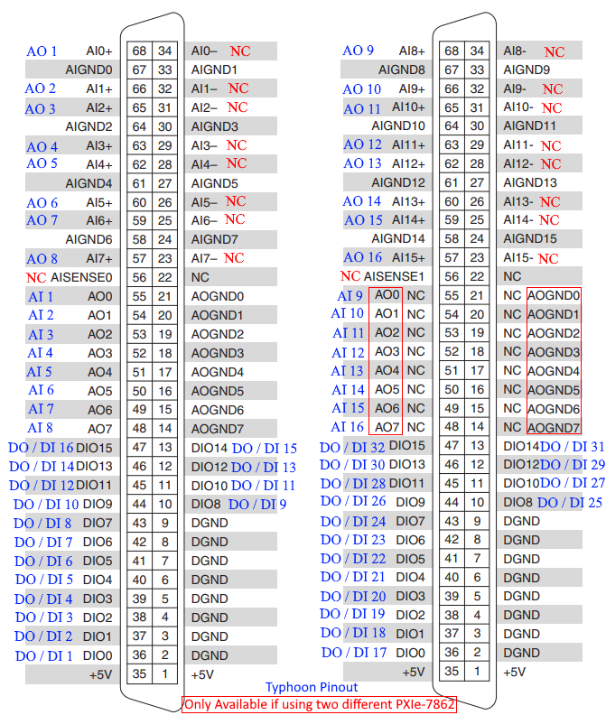

# Typhoon to National Instruments Interface Board

## Overview
This interface board was designed to connect Typhoon HIL hardware to National Instruments PXIe-7862 FPGA cards. It provides a hardware interface between Typhoon HIL systems using DIN41612 3×32 connectors and the NI SHC68-68-RMIO cable used by the PXIe-7862.

The board uses the connector spacing from the Typhoon HIL Breakout Board R3.3, which is available from the Typhoon HIL website.

The interface allows signals from the Typhoon HIL system to be routed to one or two NI PXIe-7862 cards.

---

## Hardware Compatibility

### Typhoon HIL
Any Typhoon HIL system supporting:
- Two DIN41612 3×32 connectors

### National Instruments
- PXIe-7862 FPGA cards
- SHC68-68-RMIO cables

---

## Multi-Card Support

The PXIe-7862 connector has a limited number of analog output channels.

Because of this:

- The interface board can operate with **one PXIe-7862 card**
- It can also connect to **two PXIe-7862 cards**

When using two cards, additional analog outputs become available.

When using only one card, the analog outputs routed to the second connector will not be used.

---

## Analog Signal Behavior

Typhoon HIL outputs **single-ended analog signals**, not differential signals.

Therefore:

- The PXIe-7862 **analog input (+)** receives the signal.
- The **analog input (-)** is **not connected** on this interface board.

---

## Grounding

Typhoon HIL uses shared grounds rather than per-channel grounds.

### Analog
All analog channels share **one analog ground**

### Digital
All digital channels share **one digital ground**

### Important
Analog ground and digital ground are **separate from each other**.

---

## Digital I/O Configuration

Typhoon and NI handle digital signals differently.

### Typhoon
Digital inputs and outputs are on **separate pins**.

### PXIe-7862
Digital pins are **configurable as either input or output**.

---

## Direction Selection Switches

To support this difference, the interface board includes switches that select the signal direction.

Each digital channel can be configured for:

- **NI Input (Typhoon Output)**
- **NI Output (Typhoon Input)**

If you want:

- NI to read a signal → set the switch to **NI Input / Typhoon Output**
- NI to drive a signal → set the switch to **NI Output / Typhoon Input**

All switches are labeled directly on the PCB and referenced in the pinout diagram.

---

## Pinout Diagram

---

## Notes

- Analog inputs are single-ended.
- Analog negative pins on the NI side are unused.
- Digital signals require direction selection via switches.
- Two NI cards can be used to increase available analog outputs.
